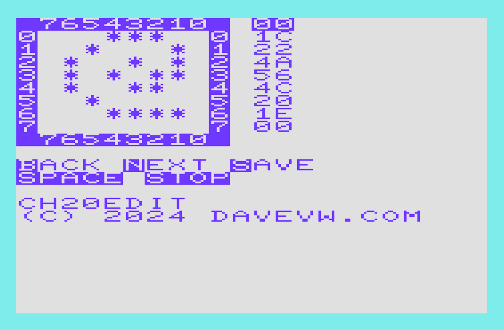

# ch20edit for Vic-20 #

Vic-20 (unexpanded) character editor

Note: load/save missing.  Use VICE monitor to save memory from $1000 to $17FF for characters.

``
save "c:/path/filename.bin" 0 1000 17ff
``

