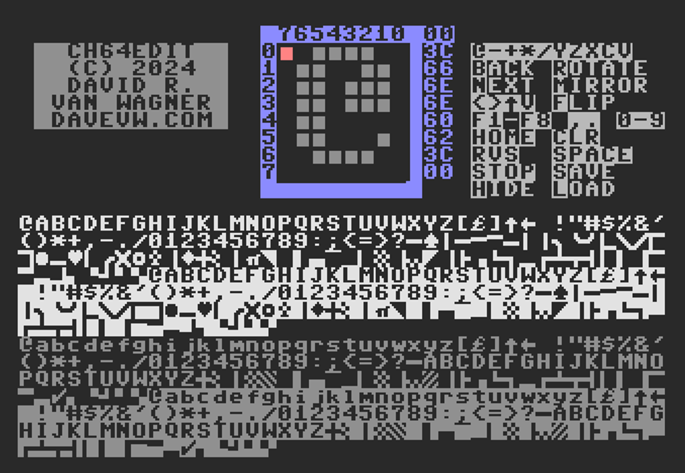

# ch64edit for C64 #

C64 character set editor

Hint: SPACE toggles pixel.  Menus are on screen.

And wrote a [blog entry](https://techwithdave.davevw.com/2024/04/edit-vic-20-programmable-characters.html).  Includes more details on keys for operations.

Abbreviated Memory map - C64

    0000-03FF lower RAM
    0400-07FF video RAM
    0800-1FFF available (was program RAM) ****
    2000-2FFF character RAM sets (was program RAM) ****
    3000-9FFF program RAM (reduced)
    D000-D7FF character ROM set 1 (uppercase/graphics) -- banked
    D800-DFFF character ROM set 2 (lowercase/uppercase) -- banked

There is also [ch20edit](https://github.com/davervw/ch20edit) for Vic-20
